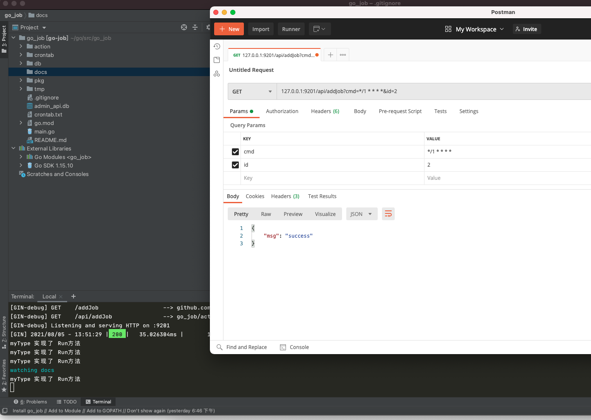
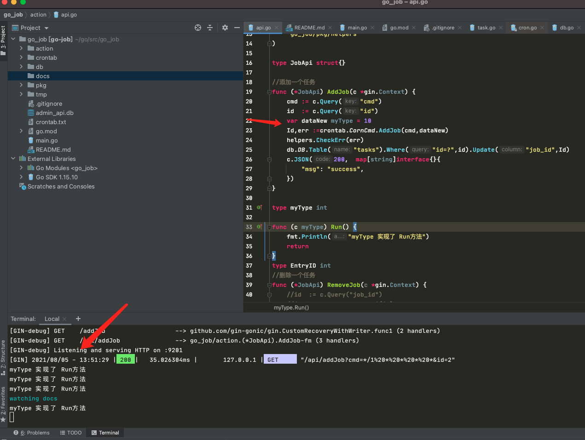

### go_job
#### 1.该项目主要是做一个curd的cron定时任务。应用端PHP调用GO提供的接口 进行crontab调度.
  * gin启动一个http服务 基于 `robfig/cron`提供的方法 封装API进行任务调度.
  * 使用sqlite文件数据库存储任务表数据,可以通过后台动态添加修改.

调度效果:





#### 2.数据库和表在 `db` 目录下

#### 3.接口
  * `/api/addJob`    添加一个任务
  * `/api/removeJob` 剔除一个任务
  * `/api/stopJob`   停止调度器
  * `/api/startJob`  启动调度器
  
  默认启动会加载所有状态为正常的任务
```go
//启动并执行任务
func Start() {
	CornCmd.Start()
	var TaskList []TaskList
	//将所有任务放入队列
	result := db.DB.Table("tasks").Find(&TaskList)
	helpers.CheckErr(result.Error)
	fmt.Println(TaskList)
	for _,value := range TaskList  {
		CornCmd.AddFunc(value.Cycle, func() {
			if value.Type == 1 {
				//执行一个url
				helpers.CurlAPi(value.Cycle)
			}
			if value.Type == 2 {
				//执行一个shell
			  helpers.ShellExcel(value.Cycle)
			}
			if value.Type == 3 {
				//发送邮件
			}
		})
	}

}

```  
  
#### 4.启动服务 默认监听 `9201`端口

```shell script
go run main.go 或者 air
```